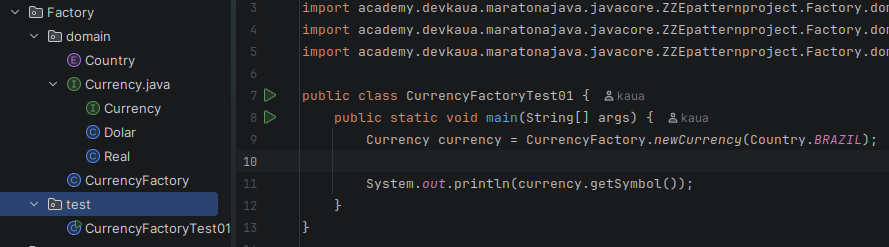

# Patternproject

### Factory

> Ele encapsula a lógica de criação de objetos. Em vez de o cliente instanciar
> as classes concretas, ele solicita uma interface, que decide qual instância
> retornar com base em um parâmetro.

- Porque fazer isso?
  - Desacoplamento: O método main lida com uma ionterface. Ele apenas sabe que recebe um objeto que segue o contrato.
  - Facilidade na Refatoração: Se for mudar algo no código ou se precisarmos adicionar uma nova Class, alteramos apenas a Factory e as classes específicas. O código que consome, não será afetado.
  - Segurança: Impede que a lógica de "qual objeto criar" fique espalhada por todo o projeto.